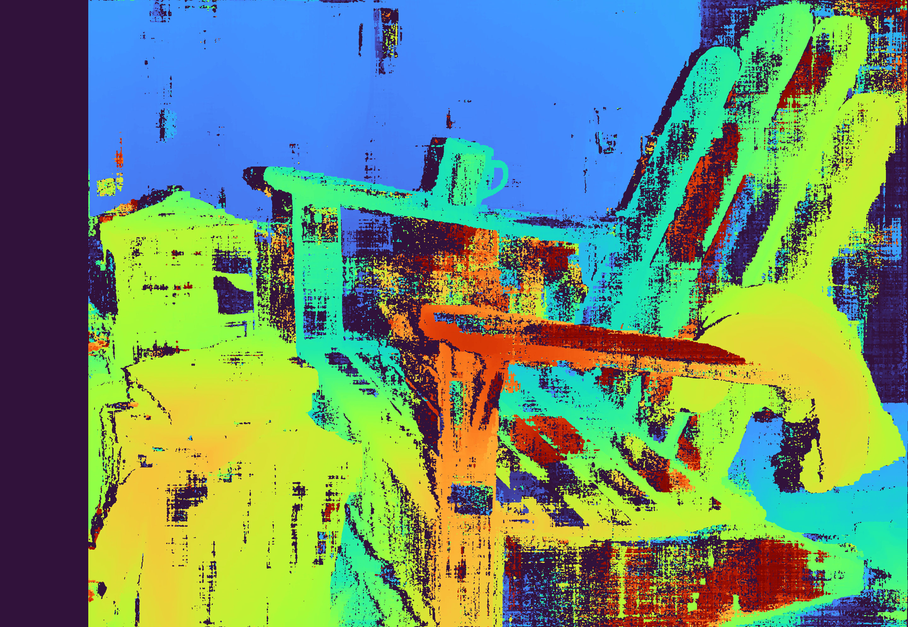

# LumenStereo

A real-time GPU-accelerated stereo depth estimation pipeline implemented in C++/CUDA.


## Sample Images

| Input (`im0.png`) | OpenCV Disparity | LumenStereo Disparity |
|---|---|---|
|  |  |  |

## Features

- **GPU-Accelerated SGBM**: Full Semi-Global Block Matching implementation on CUDA
- **Dual Cost Modes**: SAD (with Sobel-x prefilter) and Census (5×5 sparse) matching
- **4/8 Direction SGM**: Cost aggregation along multiple paths with adaptive P2 penalties
- **Subpixel Precision**: 1/16 pixel disparity accuracy via parabola fitting
- **VRAM-Efficient**: uint8 cost volume with runtime cost scaling — runs 2880×1988 in <6 GB
- **Real-time Performance**: 1+ FPS at 2880×1988, 30+ FPS at 640×480
- **Interactive Viewer**: ImGui-based viewer with parameter tuning
- **Camera Calibration**: Checkerboard detection and stereo calibration
- **GPU Rectification**: CUDA-accelerated image remapping
- **Point Cloud Export**: PLY format with color

## Performance

| Resolution | Max Disparity | Time | FPS |
|------------|---------------|------|-----|
| 640×480    | 64            | 30 ms | 33 |
| 1280×720   | 128           | 150 ms | 6.7 |
| 1920×1080  | 128           | 400 ms | 2.5 |
| 2880×1988  | 192           | 1500 ms | 0.7 |

*Tested on NVIDIA GeForce RTX 4050 Laptop GPU (6GB)*

### LumenStereo vs OpenCV SGBM

Comparison on the Middlebury Adirondack-perfect dataset (2880×1988, 290 disparities, `blockSize=5`, `P1=200`, `P2=800`, Census cost, 4 directions):

| Metric | LumenStereo | OpenCV SGBM |
|--------|-------------|-------------|
| **Time** | ~380 ms (GPU) | ~22,000 ms (CPU) |
| **MAE** | 30.92 px | 19.67 px |
| **Bad > 2 px** | 56.78% | 31.37% |
| **Valid pixels** | 99.3% | 74.9% |

LumenStereo is significantly faster thanks to CUDA acceleration but currently trades off some accuracy. The higher valid-pixel count indicates LumenStereo assigns disparities in regions where OpenCV's internal heuristics reject ambiguous matches, which inflates the error metrics. Key remaining quality gaps include fine-grained noise in textured regions and less conservative filtering.

Run the comparison yourself:

```bash
./build/compare_opencv --middlebury ./dataset/Adirondack-perfect
```

This produces `lumenstereo_disparity.png` and `opencv_disparity.png` using the same `[0, maxDisparity] -> [0, 255]` color scale for direct visual comparison.

## Quick Start

### Prerequisites

```bash
# Ubuntu 22.04+
sudo apt install build-essential cmake
sudo apt install libopencv-dev libglfw3-dev libyaml-cpp-dev
sudo apt install libgtest-dev
sudo apt install nvidia-cuda-toolkit  # or install CUDA Toolkit manually
```

### Build

```bash
mkdir build && cd build
cmake -DCMAKE_BUILD_TYPE=Release ..
make -j$(nproc)
```

### Run the Viewer

```bash
# Download Middlebury dataset first
./stereo_viewer --middlebury ../dataset/Adirondack-perfect
```

### Run Benchmarks

```bash
# Compare against OpenCV
./compare_opencv --middlebury ../dataset/Adirondack-perfect

# Run unit tests
./stereo_tests

# Evaluate against ground truth
./evaluate --middlebury ../dataset/Adirondack-perfect
```

## Project Structure

```
LumenStereo/
├── include/stereo/       # Public headers
│   ├── sgbm_gpu.h        # SGBM interface
│   ├── calibration.h     # Calibration API
│   ├── rectification.h   # GPU rectification
│   ├── depth_map.h       # Depth conversion
│   ├── point_cloud.h     # PLY export
│   ├── cuda_buffer.h     # RAII GPU memory wrapper
│   └── common.h          # Error handling, utilities
├── src/                  # Implementation
│   ├── sgbm_kernels.cu   # CUDA kernels (cost, aggregation, WTA)
│   ├── sgbm_gpu.cu       # Pipeline orchestration
│   ├── calibration.cpp   # OpenCV-based calibration
│   ├── rectification.cu  # GPU remapping
│   └── depth_map.cu      # Disparity-to-depth, colorization
├── viewer/               # Interactive application
├── tools/                # Command-line utilities
└── tests/                # Unit tests
```

## Algorithm Overview

### SGBM Pipeline

```
Input Images → Prefilter → Cost Volume → SGM Aggregation → Disparity Selection → Post-Processing
     ↓            ↓            ↓               ↓                  ↓                    ↓
  Grayscale   Sobel-x +    SAD sum or     4/8 direction      WTA + subpixel      LR check,
  conversion  clip (SAD)   Census Hamming  adaptive P2        refinement          median filter
                           (uint8×scale)
```

### Key CUDA Kernels

1. **Prefilter** (`prefilterXSobel`)
   - Sobel-x gradient + clip to `[-preFilterCap, preFilterCap]`
   - Normalizes illumination and bounds per-pixel cost contribution (SAD mode)

2. **Cost Computation** (`computeCostSAD_shared`, `computeCostCensus_naive`)
   - SAD: shared memory tiled, stores mean as uint8
   - Census: 5×5 sparse transform (24-bit) + Hamming distance

3. **Cost Aggregation** (`aggregateCostHorizontal/Vertical/Diagonal`)
   - Dynamic programming along scanlines with **costScale amplification** (uint8 costs × scale → uint16 effective range so P1/P2 have correct ratio)
   - **Adaptive P2**: `P2_eff = max(P1+1, P2×8/max(8, gradient))` — reduces smoothness penalty at strong intensity edges to preserve depth discontinuities

4. **Disparity Selection** (`selectDisparityWTA`)
   - Winner-takes-all minimum cost
   - Parabola subpixel refinement

5. **Post-Processing**
   - Left-right consistency check
   - Speckle filtering
   - 3×3 median filter (single pass)

## Usage Examples

### Basic Stereo Matching

```cpp
#include "stereo/sgbm_gpu.h"

stereo::StereoParams params;
params.maxDisparity = 128;
params.blockSize = 5;
params.P1 = 200;   // 8 * blockSize²
params.P2 = 800;   // 32 * blockSize²
params.preFilterCap = 31;

stereo::StereoSGBM sgbm(params);

cv::Mat disparity;
sgbm.compute(leftImage, rightImage, disparity);

// disparity is CV_16SC1 in 1/16 pixel units
cv::Mat disparityFloat;
disparity.convertTo(disparityFloat, CV_32F, 1.0/16.0);
```

### Camera Calibration

```cpp
#include "stereo/calibration.h"

// Collect calibration images
stereo::StereoCalibrator calibrator(cv::Size(9, 6), 25.0f);

for (const auto& [left, right] : imagePairs) {
    calibrator.addImagePair(left, right);
}

// Run calibration
stereo::CameraParams params = calibrator.calibrate();

// Save for later
stereo::saveCameraParams("calibration.yaml", params);
```

### GPU Rectification

```cpp
#include "stereo/rectification.h"

// Load calibration
stereo::CameraParams params;
stereo::loadCameraParams("calibration.yaml", params);

// Create rectifier (uploads maps to GPU)
stereo::StereoRectifier rectifier(params);

// Rectify images
cv::Mat leftRect, rightRect;
rectifier.rectify(leftRaw, rightRaw, leftRect, rightRect);
```

## Command-Line Tools

### Calibration Tool

```bash
# Generate checkerboard
./calibration_tool generate-board --size 9x6 --square 50 --output board.png

# Calibrate from images
./calibration_tool calibrate --images ./calib_images --board 9x6 --square 25.0 --output calib.yaml

# Apply rectification
./calibration_tool rectify --calib calib.yaml --left left.png --right right.png

# Benchmark GPU vs CPU
./calibration_tool benchmark-rectify
```

### Benchmark Tool

```bash
./benchmark --middlebury dataset/Adirondack-perfect
```

### Evaluation Tool

```bash
./evaluate --middlebury dataset/Adirondack-perfect
```

## Parameter Tuning Guide

| Parameter | Effect | Typical Range | Default |
|-----------|--------|---------------|---------|
| `blockSize` | Matching window size (odd) | 3-11 | 5 |
| `maxDisparity` | Maximum search range | 64-256 | 128 |
| `P1` | Small disparity change penalty | 50-400 | 200 (`8 × blockSize²`) |
| `P2` | Large disparity change penalty | 200-1600 | 800 (`32 × blockSize²`) |
| `preFilterCap` | Sobel gradient clip (SAD mode) | 15-63 | 31 |
| `uniquenessRatio` | Reject ambiguous matches (%) | 0-15 | 5 |
| `disp12MaxDiff` | LR consistency threshold | 1-5 or -1 | 1 |
| `numDirections` | SGM paths (4 or 8) | 4 for speed, 8 for quality | 8 |
| `matchingCostMode` | Cost function (SAD or Census) | SAD / Census | Census |

**Tips:**
- P1/P2 follow the standard SGM convention `P1 = 8×cn×blockSize²`, `P2 = 32×cn×blockSize²` (cn=1 for grayscale). The engine internally applies a `costScale` so uint8 costs reach the correct ratio with these penalties.
- **Adaptive P2** automatically reduces the penalty at strong intensity edges — you do not need to lower P2 manually to preserve depth discontinuities.
- `preFilterCap` only applies in SAD mode; it clips the horizontal Sobel gradient and bounds per-pixel cost.
- Census mode is generally more robust to illumination changes than SAD.
- Higher `maxDisparity` for closer objects (uses more GPU memory).
- 4 directions is ~2× faster than 8 with minimal quality loss.

## Profiling with Nsight

```bash
# Compile with debug info
cmake -DCMAKE_BUILD_TYPE=RelWithDebInfo ..

# Profile with Nsight Compute
ncu --set full ./benchmark --middlebury ../dataset/Adirondack-perfect

# Profile with Nsight Systems (timeline)
nsys profile ./benchmark --middlebury ../dataset/Adirondack-perfect
```

## Known Limitations

1. **Memory**: 256 disparities at 2880×1988 approaches the 6 GB VRAM budget (buffers are freed aggressively between pipeline stages to stay within limits)
2. **8-Direction SGM**: Requires additional memory for diagonal state
3. **Shared Memory**: SAD cost kernel limited by 48 KB shared memory; Census cost uses a naive (non-shared-memory) kernel
4. **Aggregation**: Sequential per-row/column (bottleneck for large images)

## Future Improvements

- [ ] Shared-memory Census cost kernel
- [ ] Warp-level aggregation optimization
- [ ] Half-precision (FP16) support
- [ ] Diagonal batching for 8-direction SGM
- [ ] Multi-GPU support
- [ ] Real-time camera input

## References

- Hirschmüller, H. (2005). "Accurate and Efficient Stereo Processing by Semi-Global Matching and Mutual Information"
- Middlebury Stereo Evaluation: https://vision.middlebury.edu/stereo/

## License

MIT License - see [LICENSE](LICENSE) for details.

## Acknowledgments

- Middlebury Stereo Benchmark for test datasets
- OpenCV for calibration algorithms
- Dear ImGui for the viewer interface

## Middlebury / Quality Roadmap

| Step | Goal | Status |
|------|------|--------|
| **1** | Full-res `ndisp` without OOM: stack limit 512, 8-bit cost volume, runtime guard | Done |
| **2** | Use calib `ndisp` in tools/viewer (`middleburyMatcherMaxDisparity`) | Done |
| **3** | Census (5×5) + Hamming cost; `StereoParams::matchingCostMode` | Done — SAD / Census combo in viewer and YAML |
| **4** | Sobel-x prefilter, adaptive P2, cost scaling, VRAM optimization | Done — `prefilterXSobel`, `costScale` amplification, aggressive buffer freeing |
| **5** | Re-measure vs ground truth | Run locally (commands below) |
| **6** | Real-time / throughput | **Next**: shared-memory Census cost, fewer SGM passes, diagonal batching, FP16 |

### Evaluation Commands

```bash
cmake --build build -j$(nproc)
./build/evaluate --middlebury ./dataset/Adirondack-perfect
./build/compare_opencv --middlebury ./dataset/Adirondack-perfect
```

`doffs` is a **depth** offset only (`Z = fB/(disp+doffs)`), not `minDisparity` for the matcher.

### Comparing Disparity Maps

Both maps must use the **same** linear disparity-to-color scale or one side will look "wrong" even when numbers are fine. `compare_opencv` maps **both** outputs with `255 / maxDisparity` (search-range scale) and masks invalid pixels to black.

## Architecture Notes

### Cost Volume and VRAM Efficiency

The cost volume is stored as **uint8** to keep VRAM under 6 GB for full-resolution Middlebury images (2880x1988 x 290 disparities). To maintain a correct cost-to-penalty ratio with P1/P2, a **costScale** factor is applied at aggregation time: each uint8 cost is multiplied by the scale factor when loaded into uint16 aggregation registers. This avoids doubling the cost volume size while keeping the effective dynamic range aligned with the smoothness penalties.

- SAD mode: `costScale = blockSize * blockSize` (recovers the sum from the stored mean)
- Census mode: `costScale = max(1, (blockSize^2 * 2 * preFilterCap) / 255)` (scales Hamming distance to a comparable range)

### Adaptive P2

During SGM aggregation, P2 is dynamically reduced at strong intensity edges:

```
P2_eff = max(P1 + 1, P2 * 8 / max(8, gradient))
```

This preserves depth discontinuities at object boundaries while maintaining smoothness in uniform or textured regions. Only gradients above 8 begin to reduce P2, and the minimum is always `P1 + 1`.

### Prefiltering (SAD Mode)

In SAD mode, both input images pass through a horizontal Sobel filter clipped to `[-preFilterCap, +preFilterCap]` and offset to unsigned range. This normalizes illumination differences and bounds the per-pixel SAD contribution, matching OpenCV's `PREFILTER_XSOBEL` behavior.